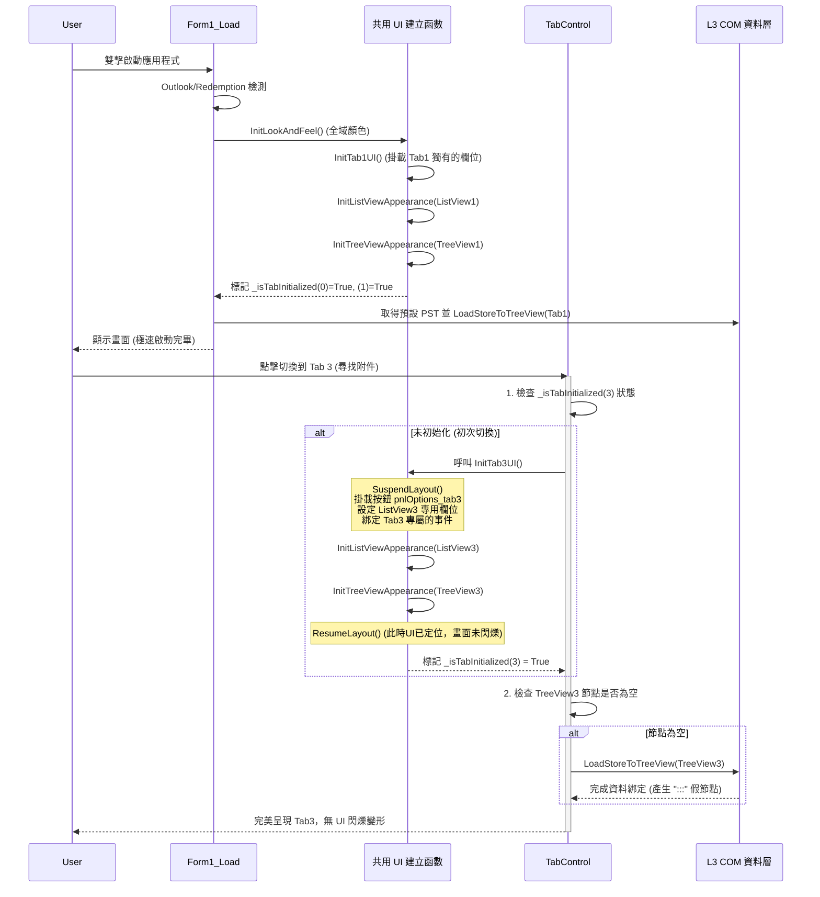

# 啟動效能優化與架構重構計畫

這個計畫旨在解決應用程式啟動時因為「一次性載入過多非必要畫面 (Tab2~Tab5)」以及「COM 初始化瓶頸」所造成的啟動延遲。

## User Review Required

> [!IMPORTANT]
> 此計畫會將大量的 UI 初始化動作（例如 `InitListViews`、`InitTab2UI` 等）從 `Form1_Load` 延遲到切換該分頁時才執行。請確認這樣的 Lazy Load（懶加載）體驗是否符合您的需求？（使用者只會在第一次切換分頁時感受到微小的初始化延遲，但能換來極快的程式啟動速度）。

## 📈 現有瓶頸分析回答

1. **`GetSortedXXX()` 與 `LoadXXX()` 效能改善空間**：
   - 目前 `GetSortedSubFolders` 已經做了 `FolderSortInfo` 與 Name 的記憶體快取排序（極好的優化），單次屬性讀取讓效能提升很多。
   - `GetSortedStores` 耗費 130ms 是因為它會一次向 COM 要回所有掛載的 PST 檔案。另一個潛在的微縮優化是：**可否只先抓「預設收件匣的 Store」** 進行載入顯示，其餘的 PST 等程式 `Shown` 之後再由背景慢慢補到節狀圖中？(不過實務上 130ms 是合理的起始連線成本，建議保留現狀以避免背景補節點的 UI 閃動，而是去砍掉其他 UI 初始化時間)。
   - `LoadStoreToTreeView` 已實作 `:::` 的假節點，這是標準且效能最佳的 Lazy Load 策略，這部分很棒，不用改。

2. **`InitLookAndFeel()` 的 UI 初始化一定要在 Load 時全做嗎？**
   - **絕對不需要！** 這是圖中 `InitListViews` 等步驟耗損 60ms 以上的元凶。
   - 在您的**方案 a (背景初始化)** 與 **方案 b (切換時初始化)** 中，**強烈建議採用「方案 b」 (Lazy UI Init)**。
   - 因為某些 UI 元件（如 Panel 的 Dock 與 Container 嵌套）在背景執行緒中做會導致 `InvalidOperationException`（跨執行緒操作 UI 控制項），而使用 Invoke 退回主執行緒有時候會卡頓畫面。最好的解法就是：**使用者切換過去時，再花這幾毫秒處理該分頁的組裝**。

3. **更好的初始化順序 (解決雞生蛋蛋生雞)**：
   我們將建立一個「按需載入 (On-Demand Loading)」的生命週期架構。

---

## Proposed Changes

### 1. Form1.vb 的架構拆解與延遲載入 (Lazy UI Initialization)

目前所有 UI 都在 `InitLookAndFeel` 一次做完：
#### [MODIFY] Form1.vb
- **不重複建構，改用帶參數的共用函數**：
  - 為了避免寫出 `InitListView1`, `InitListView2` 等一堆重複內容的副程式，我們將共用外觀設定抽取出來：
    ```vb
    Private Sub InitListViewAppearance(lv As ListView)
        ' 設定字型、雙緩衝、共用事件 (GotFocus, MouseMove 等)
    End Sub
    
    Private Sub InitTreeViewAppearance(tv As TreeView)
        ' 設定字型、顏色、雙緩衝、共用事件
    End Sub
    
    Private Sub InitSplitContainerBehavior(scnr As SplitContainer)
        ' 設定 MouseMove 游標變化等行為
    End Sub
    ```
  - 至於每個 ListView 特有的欄位定義 (例如 `ListView1` 需要 "資料夾名稱" 等欄位，`ListView4` 需要 "收到時間" 等欄位)，這會包裝在各自分頁的初始化中，像是 `InitTab1UI()`、`InitTab4UI()` 裡面。

- **使用布林陣列統一管理初始化狀態**：
  - เรา宣告一個全域的布林陣列 `Private _isTabInitialized(5) As Boolean` 。
  - **Index 0**：代表 Form 本身以及 Tab1 已經完成初始化，取代舊的 `_isFirstInit` 變數。
  - **Index 1 ~ 5**：分別對應 Tab1 ~ Tab5 的 UI 是否已經建立完畢。
  - （註：為了索引直覺，Index 1對應Tab1，依此類推，而 Index 0 保留給 Form 全域層級與啟動第一階段的標記）。
  
- `InitLookAndFeel()` 將**只初始化 Form 全域外觀與 Tab1 相關的畫面**：
  - 呼叫 `InitTab1UI()`（裡面會設定 Tab1 專用的 ListView1 Column、按鈕等，並呼叫共用的 `InitListViewAppearance(ListView1)` 及 `InitTreeViewAppearance(TreeView1)` 等）。
  - 將 `_isTabInitialized(0) = True` 和 `_isTabInitialized(1) = True`。

- 在 `TabControl1_SelectedIndexChanged` 事件中進行**黃金切割 (黃金分解順序)**：
  - 為了確保畫面在「使用者看到之前」就安排好，不會有在眼前改 size 或是增加按鈕的突兀感，我們會在 `SelectedIndexChanged` 中運用完整的順序保護。
  - 這裡附上完整的**呼叫順序流程圖**：



### 2. Form1_ComL3.vb 與 Form1.vb 相互配合的 COM 優化

#### [MODIFY] Form1_ComL3.vb
- 原有的結構與 COM Lazy Load 已經極好 (Nodes = `:::` 機制)，這個部分只需要和 Tab 延遲載入串接好，不需大幅度變更。 
- 原有大量註解，將特別注意透過正確方式補完而不是取代。
- by AntiGravity 會標記新增註解。

## Open Questions

> [!TIP]
> 1. 我們將先集中火力落實「[第一階段] 延遲載入 UI（Lazy Load UI）」的修改，這應該能直接剷除因為 `InitListViews` 帶來的 60ms 啟動延遲。
> 2. `_isTabInitialized(5)` 陣列的對應關係：Index 0 為 Form (相等於過去的 `_isFirstInit`)，Index 1~5 代表各自分頁。這個設定是否同意？
> 如果您對 Mermaid 流程圖展現的呼叫順序沒有疑義，請您核准，我們就可以著手修改 `.vb` 的程式碼了！

## Verification Plan

### 自動與手動測試
1. 啟動並觀察 Debug 視窗：確保 `InitListViews` 花費的時間大幅下降到只剩初始化 Tab1 的時間 (+- 10ms)，甚至從清單上消失變成 `InitTab1UI` 幾毫秒。
2. 確認啟動後主畫面與 TreeView1 正常顯示，沒有破圖，且點擊能正確展開 `:::`。
3. 手動觸發 `TabControl1` 切換，依次點擊「依日期統計」、「尋找附件」等分頁。
4. 驗證每個分頁被點擊時，才會即時掛載其內部的面板、按鈕設定、ListView 欄位與 TreeView 事件！不會有事件重複註冊的情況。
