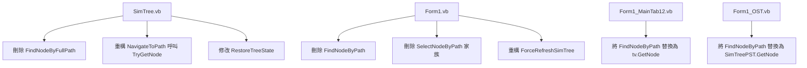

# 核心尋路引擎重構與重複函數取代計劃

本計劃旨在將日前已成功部署至 `SimTree.vb` 作為底層核心方法的 `TryGetNode()` 與 `GetNode()` 升級為全專案的統一尋路引擎。
藉此**完整取代**原本散落在 `Form1_SimTree.vb` 與 `Form1.vb` 各處之低效、重複的尋路及導航函數，達成「控制項自治」、「提升搜尋效能」與「簡化程式碼結構」三大目標。

---

## 核心分析與評估（為何可以完整取代）

經過深入的研究與比對，`TryGetNode()` 與 `GetNode()` 已經完全具備了取代舊方法的條件，分析如下：

### 1. 取代 `SimTree.vb` 原有的 `FindNodeByFullPath` 與 `NavigateToPath`
*   **`FindNodeByFullPath` (私有)**：舊版是利用全路徑字串以 `\` 切割，並在每層進行 $O(N)$ 遞迴比對，若 `expandAlongTheWay` 為 True 則呼叫 `node.Expand()`（從而透過原生 WinForms 事件觸發 `BeforeExpand` 進行 Lazy Load）。
    *   **取代性**：`TryGetNode` 採用相同的「路徑切段尋路法」設計，且內部參數完全支援 `expandAlongTheWay`、`searchOnlyExpanded` 等通行判斷，並跳過佔位符 `:::`。因此，所有 `FindNodeByFullPath` 的使用點均可直接用 `TryGetNode(path, foundNode, searchOnlyExpanded:=False, expandAlongTheWay:=True)` 完美取代，原函數可安全刪除。
*   **`NavigateToPath` (公共)**：舊版主要是先以 `FindNodeByFullPath` 尋找節點，再手動設定選取、捲動畫面並觸發統計事件。
    *   **取代性**：`TryGetNode` 在設計時便內建了 `selectAndFire`（選取並觸發統計）與 `ensureVisible`（確保可見）等參數，這些參數與 `NavigateToPath` 的職責完全契合。我們只需將 `NavigateToPath` 的內部實現重構為呼叫 `TryGetNode`，並將其功能擴充支援 `expandTarget`（是否展開目標節點，用以取代 Form1.vb 端的 status 還原參數）即可。

### 2. 取代 `Form1.vb` 原有的 `FindNodeByPath`, `SelectNodeByPath`, `SelectNodeByPathRecursive`
*   **`FindNodeByPath` (私有)**：舊版是透過全樹暴力遞迴，每次都比對 `Folder.FolderPath`（經 `SafeGetPath` 轉換）是否吻合，效能為 $O(N)$，且在大型資料夾結構下會造成严重的 UI 執行緒佔用。
    *   **取代性**：Outlook `FolderPath` 各段名稱正好完全對應樹狀節點的 `node.Text`。`SimTree` 的公共方法 `GetNode(path, searchOnlyExpanded)` 在背後藉由 `TryGetNode` 以 $O(D \times B)$ 的極速路徑定位，效能高出數個數量級！所有 `FindNodeByPath` 的呼叫皆可改用 `tv.GetNode(path, searchOnlyExpanded)` 取代，原函數可直接廢除。
*   **`SelectNodeByPath` 與 `SelectNodeByPathRecursive` (私有)**：舊版在 `Nodes.Clear()` 重建樹之後，遞迴尋找路徑匹配的節點，並在遇到尚未展開的 `:::` 佔位節點時手動觸發 `LoadSubFolderToTreeView` 載入子節點，最後選取並捲動可見。
    *   **取代性**：`tv.NavigateToPath(path, fireEvent:=True, expandTarget:=wasExpanded)` 藉由傳遞 `expandAlongTheWay:=True` 給 `TryGetNode`，會在尋路途中自動對未展開節點呼叫 `node.Expand()`。因為 `Form1` 已經為 `SimTree` 註冊了 `BeforeExpand` 事件，這會**自動且原生**地觸發 `LoadSubFolderToTreeView` 進行 Lazy Load！這不僅完全實現了舊版功能，更完美解耦了 Form1 與控制項底層之間的強綁定。這兩個繁雜的私有函數可被完全刪除。

---

## 變更詳情與擬改動檔案

本重構遵循 **小塊寫入 (Chunked Edits)** 與 **修改後立即複檢** 原則，將修改拆分為清晰獨立的步驟。



### 1. [MODIFY] [Form1_SimTree.vb](file:///d:/Users/Simon/Dropbox/私人文件/Visual%20Studio/Visual%20Studio%2018%20(2026)/Outlook%20Assistant%20-%20(AntiGravity測試區)/Form1_SimTree.vb)
*   **重構 `NavigateToPath`**：擴充其功能以支援 `expandTarget` 參數，並使用 `TryGetNode` 實現：
    ```vb
    Public Function NavigateToPath(fullPath As String, Optional fireEvent As Boolean = True, Optional expandTarget As Boolean = False) As Boolean
        ' by Gemini 3.5 Flash, 2026/05/21: 重構 NavigateToPath 以完全使用 TryGetNode 核心引擎
        Dim targetNode As TreeNode = Nothing
        If TryGetNode(fullPath, targetNode, searchOnlyExpanded:=False, expandAlongTheWay:=True, selectAndFire:=fireEvent, ensureVisible:=True) Then
            If Not fireEvent Then
                ClearSelectedNodes()
                AddSelectedNode(targetNode)
            End If
            If expandTarget AndAlso targetNode IsNot Nothing Then
                targetNode.Expand()
            End If
            Return True
        End If
        Return False
    End Function
    ```
*   **修改 `RestoreTreeState`**：將 `FindNodeByFullPath` 的呼叫修改為 `TryGetNode` 的呼叫。
*   **刪除 `FindNodeByFullPath` 函數**。

### 2. [MODIFY] [Form1.vb](file:///d:/Users/Simon/Dropbox/私人文件/Visual%20Studio/Visual%20Studio%2018%20(2026)/Outlook%20Assistant%20-%20(AntiGravity測試區)/Form1.vb)
*   **刪除私有函數**：
    *   `FindNodeByPath` (約 L1685 - L1711)
    *   `SelectNodeByPath` (約 L1712 - L1720)
    *   `SelectNodeByPathRecursive` (約 L1721 - L1751)
*   **重構 `ForceRefreshSimTree`** (約 L952 / L1049)：
    *   在還原選取狀態時，將原 `FindNodeByPath` 替換為 `tv.GetNode(path, searchOnlyExpanded:=True)`。
    *   在選回原節點時，將原 `SelectNodeByPath(SimTree1, oldPath, wasExpanded)` 替換為 `SimTree1.NavigateToPath(oldPath, fireEvent:=True, expandTarget:=wasExpanded)`。

### 3. [MODIFY] [Form1_MainTab12.vb](file:///d:/Users/Simon/Dropbox/私人文件/Visual%20Studio/Visual%20Studio%2018%20(2026)/Outlook%20Assistant%20-%20(AntiGravity測試區)/Form1_MainTab12.vb)
*   **重構 `ReExpandNodeByPath`** (約 L808)：
    *   將 `FindNodeByPath(currentNodes, targetPath, searchOnlyExpanded:=False)` 替換為 `tv.GetNode(targetPath, searchOnlyExpanded:=False)`。
*   **重構 `ForceRefreshSimTree` 中選回舊選取處** (約 L952)：
    *   將 `FindNodeByPath(tv.Nodes, path, searchOnlyExpanded:=True)` 替換為 `tv.GetNode(path, searchOnlyExpanded:=True)`。

### 4. [MODIFY] [Form1_OST.vb](file:///d:/Users/Simon/Dropbox/私人文件/Visual%20Studio/Visual%20Studio%2018%20(2026)/Outlook%20Assistant%20-%20(AntiGravity測試區)/Form1_OST.vb)
*   **重構 `CopyFolder_Click`** (約 L602)：
    *   在自動刷新目標 PST 後尋找選回原資料夾節點處，將 `FindNodeByPath(SimTreePST.Nodes, targetFolderPath, searchOnlyExpanded:=False)` 替換為 `SimTreePST.GetNode(targetFolderPath, searchOnlyExpanded:=False)`。

---

## 驗證與複檢計劃

### 自動與手動測試步驟
1.  **編譯檢查**：在 Visual Studio 中重新建置專案，確認沒有任何語法錯誤、缺少引數或型別不匹配的問題。
2.  **基本導覽功能測試**：
    *   點選 Tab1 ~ Tab5 的各個資料夾，確認能夠順暢展開並正確在右側 ListView 渲染郵件統計及清單。
    *   使用鍵盤方向鍵、Space 鍵導覽樹狀圖，確認一切操作如常。
3.  **狀態還原測試 (關鍵點)**：
    *   在 Tab1 選取深層資料夾並展開多個父資料夾，按下 **F5** 重新整理。
    *   驗證：樹狀圖是否成功重整，並**精確還原**原有的展開狀態、選取高亮焦點。
4.  **Tab7 複製資料夾測試**：
    *   在 Tab7 執行 OST 複製資料夾到 PST 的作業。
    *   驗證：複製完成後，下方的 PST 樹狀圖是否順利重載並**自動選回**原本的資料夾。
5.  **改後雙重複檢 (嚴格遵循 Rule)**：
    *   使用 `view_file` 工具讀取所有修改段落，確認無變數遺漏、邏輯對齊，並無多餘之殘留程式碼。

---
> [!NOTE]
> 本次修改中的所有程式碼變更，都將加上標記 `by Gemini 3.5 Flash, 2026/05/21` 以確保變更歷程的辨識性，並保留原有的歷史註解！
