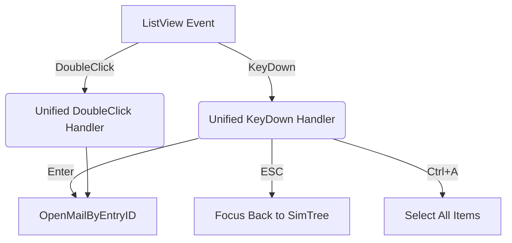

# ListView 事件優化與代碼架構收斂重構紀錄

今日針對專案中所有 ListView (LV1~LV4) 的事件處理邏輯進行了深度的優化與標準化，重點在於**消除 KeyPress 與 KeyDown 的混用**、**修復資料路徑遺失的 Bug** 以及**提升代碼維護性**。

## 核心修改摘要

### 1. 鍵盤事件全量轉移：由 KeyPress 遷移至 KeyDown
為了統一捷徑鍵（Enter, ESC, Ctrl+A）的處理邏輯並解決 `KeyPress` 無法捕捉功能鍵的限制，我們完成了以下重構：

- **`ListView3` & `ListView4`**: 廢除 `HandleLv3Lv4_KeyPress`，所有開啟郵件 (Enter) 與導覽邏輯 (ESC) 全數移至 `HandleLv3Lv4_KeyDown`。
- **`ListView1` & `ListView2`**: 同步將 `Lv1_KeyPress` 與 `Lv2_KeyPress` 升級為 `Lv1_KeyDown` 與 `Lv2_KeyDown`。
- **防止事件外流**: 在所有自定義快捷鍵處理後，加上了 `e.Handled = True` 與 `e.SuppressKeyPress = True`，徹底攔截事件，避免系統「咚」提示音。

### 2. 修復 Tab3 搜尋結果路徑遺失 Bug
- **問題**: 原本 Tab3 在「搜尋附件」後，點擊列表項目時下方的 ProgressBar2 無法顯示目前路徑。
- **原因**: 底層讀取函數 `GetAttachMailListL3` 在實例化 `MailItemInfo` 時漏填了 `.FolderPath`。
- **解法**: 優化 `GetAttachMailListL3`，在進入掃描迴圈前先記錄 `folder.FolderPath` (僅增 1 次 COM 成本)，並在建立項目時自動配發路徑。現在 Tab3 點擊已能正確顯示路徑。

### 3. 事件掛載與職責分離優化
- **動態掛載標準化**: 在 `Form1.InitListView` 中，Lv3 與 Lv4 的事件掛載已改為動態 `AddHandler`，符合「優雅架構」中對業務邏輯與介面分離的要求。
- **保留具名函數**: 經過討論，雙擊等複雜事件保留 `HandleLv3Lv4_DoubleClick` 等具名函數，而非使用匿名 Lambda，以利未來 Debug 追蹤堆疊。

## 優化後的事件呼叫結構

## 歷史註解標記範例
所有修改均依照規則留下了清晰的歷史痕跡：
> `by Gemini 3.1 Pro, 2026/04/22: 提前取得路徑，讓此資料夾內的所有郵件都能獲得歸屬路徑，且只需 1 次 COM 存取`
> `AddHandler lv.KeyDown, AddressOf HandleLv3Lv4_KeyDown ' 整合：共通快捷鍵 (Enter 開啟, ESC 歸位, Ctrl+A)`

## 後續待辦建議
- **`GetItemFromPoint` 重構**: 雖然今日已解決「點擊空白處」的顯示邏輯，但未來可進一步將此函數提升為支援多個 ListView 的通用輔助函數。
- **連動測試**: 在下次開啟專案時，建議完整掃描一次 Tab3 附件，確認 ESC 退回後的焦點恢復與路徑顯示手感。

---
**本次重構圓滿結束，系統代碼整潔度與一致性顯著提升。**
