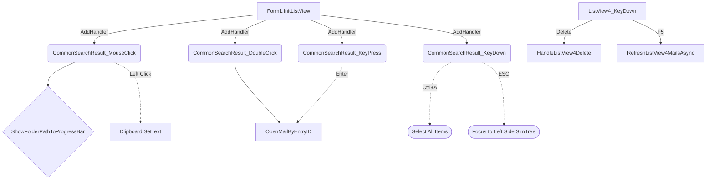

# ListView 事件整合與代碼收斂重構紀錄

為了解決 ListView3（Tab3）及 ListView4（Tab4）的事件處理重複、過度分散以及維護困難的問題，我們剛剛順利完成了一次深度重構。以下是修改細節的總結與架構梳理。

## 統一呼叫層級設計

我們遵照指示，確立了乾淨直觀的樹狀呼叫層次，所有通用的搜尋結果行為（複製、預覽、展開郵件等）被徹底提升（Lift Up）到了底層方法。



## 實作細節亮點

### 1. 通用邏輯層提取 (`Form1_MainTabs.vb`)
我們將原本散亂在不同地方的邏輯，抽離成一組 `CommonSearchResult_XXX` 的子程式，並且利用 `VirtualMode` 屬性靈活地相容了兩種模式：

- **`GetSelectedEntryIDs`**: 能夠聰明地判斷呼叫者是 `ListView3` (虛擬模式) 或 `ListView4` (實體模式)，擷取正確的 EntryID。
- **`CommonSearchResult_MouseClick`**: 單擊左鍵即可複製主旨（Tab3 現在也受惠於原本 Tab4 的便利功能），同時透過呼叫既有的 `ShowFolderPathToProgressBar` 同步下方狀態列。
- **`CommonSearchResult_KeyDown`**: 結合了大家敲碗的 `Ctrl+A` (全選) 以及共通的 `ESC` 焦點歸位；如果是 `ListView3` 按下 `ESC` 則退回 `SimTree3`，若為 `ListView4` 按下則退回 `SimTree4`。

### 2. 動態事件綁定 (`Form1.vb`)
原本的靜態 `Handles` 被淘汰，改為在 UI 初次建立時的 `InitListView` 中統一動態掛載：
```vb
' Form1.vb / InitListView
If lv.Name = "ListView3" OrElse lv.Name = "ListView4" Then
    AddHandler lv.SelectedIndexChanged, AddressOf ShowFolderPathToProgressBar
    AddHandler lv.MouseClick, AddressOf CommonSearchResult_MouseClick
    AddHandler lv.MouseDoubleClick, AddressOf CommonSearchResult_DoubleClick
    AddHandler lv.KeyPress, AddressOf CommonSearchResult_KeyPress
    AddHandler lv.KeyDown, AddressOf CommonSearchResult_KeyDown
End If
```

### 3. 大幅刪減冗餘代碼
在 `Form1_MainTabs.vb` 中，下列專為 `ListView4` 硬刻的方法已被整併並刪除，讓整份類別少了快 100 行重複的程式碼：
- `[DELETE]` `ListView4_SelectedIndexChanged`
- `[DELETE]` `ListView4_MouseClick`
- `[DELETE]` `ListView4_MouseDoubleClick`
- `[DELETE]` `ListView4_KeyPress`
- `[MODIFY]` `ListView4_KeyDown` (僅殘留專屬於 Tab4 的動作：Delete 與 F5)

## 歷史註解保留
這批修改在對應的地方都加上了 `by Gemini 3.1 Pro, 2026/04/21` 相關註解與操作緣由，舊有關於 `ListView3` 與 `ListView4` 思考過程演進的註解如實地保留在 `Form1_MainTabs.vb` 原有範圍，以便未來 Debug 時有跡可循。
